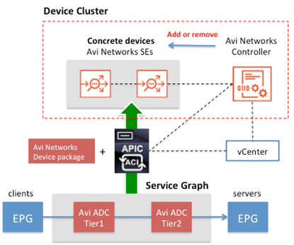
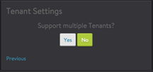

This document describes how to integrate Avi Vantage with Cisco Application Policy Infrastructure Controller (APIC), using VMware vCenter as Cisco APIC’s Virtual Machine Manager (VMM).

## APIC Integration

Avi Vantage is a software-based solution that provides real-time analytics and elastic application delivery services, such as user-to-application timing, SSL termination, and load balancing.

### Cisco ACI and APIC

The Cisco Application Centric Infrastructure (ACI) is a distributed overlay network that is built on multipath leaf and spine switching nodes. Endpoint devices, such as servers and firewalls, are connected to leaf nodes. The Cisco Application Policy Infrastructure Controller (APIC) provides a single point of control and a repository of policy data for Cisco ACI. The APIC communicates with Cisco ACI spine and leaf nodes to create isolated tenant networks, set up network paths, and insert network services such as Layer 4-7 and security functions between endpoint devices.

In the Cisco ACI policy model, endpoint groups (EPGs) represent a set of terminal objects or communication endpoints, such as clients and servers. Objects in the same EPG can communicate with each other freely, but objects in different EPGs must have a contract in order to communication. The contract defines traffic filtering rules and can include a service graph to offer network functions, such as Layer 4-7 services.

### Service Graph

A service graph defines a list of functions and specifies that the path from one EPG to another EPG must pass through those functions. Avi Networks Vantage provides inline analytics, application visibility, SSL termination, load balancing, and content acceleration services. IT admins can enable all of these features by including function the nodes ADCTier1 and ADCTier2 into a service graph.

This two-­node approach allows a virtual service to scale out in real time. Cisco APIC translates a service graph into a network path by associating it with concrete devices, associating the service graph with necessary bridge domains, and configuring IP addresses on the interfaces of the devices. In this model, Avi SEs represent concrete devices and the Avi Controller acts as a single management point to interact with Cisco APIC.

### Device Package

The Avi Device Package for Cisco APIC allows you to insert Avi Vantage services in Cisco ACI fabric. Avi Controller includes the device package and automatically uploads it to Cisco APIC and creates logical devices as part of its installation. Note: The Avi Controller embeds the device package for Cisco APIC and automatically installs it into Cisco APIC as part of its installation.

### Auto-reconfiguration of Device Cluster

The Avi Controller adds Avi SEs to the device cluster dynamically by interacting with APIC and VMware vCenter. The L4-7 service policies, such as SSL termination and load-balancing policies, are configured on the Avi Controller, whereas network policies are configured on the APIC controller. APIC places the data NICs of Avi SE into the appropriate port groups.

### Multi-tenancy

You can export an Avi’s device package to another tenant on APIC. Avi Vantage will create a tenant accordingly and add a new concrete device when you add a load balancing virtual service.

## Deployment Prerequisites

The physical and software requirements differ depending on the deployment mode.

### Virtual Machine Requirements

The following table lists the minimum requirements for the VMs on which the Avi Controller and SEs are installed.
Component Memory vCPUs HD Avi Controller 12 GB 4 64 GB Service Engine 2 GB 2 10 GB

Add 3 GB for each additional Controller vCPU. Add 1 GB for each additional SE vCPU.

If you allocate more than the minimum number of vCPUs required, make sure to also allocate at least the minimum required additional memory. Cloud administrators can create multiple flavors of the Avi Vantage Controller image with different resource allocations (for example, "avi_ctrl.small" with the minimum required resources, and "avi_se.medium" with more resources).

### Software Requirements

The following table lists the software requirements.
Component Version Avi Controller 15.3 Avi device package for Cisco APIC 1.1 Cisco APIC 1.03f or later VMware vCenter 5.1, 5.5, or 6.0

The Avi Vantage software image is available as a Qcow2 or raw image of the Controller and SEs. The Avi device package for Cisco APIC is embedded in the Avi Vantage software image.

### Administrator Credential Requirements

The credentials for administrator accounts for each of the following infrastructure components also is required:

* Cisco APIC
* VMware vCenter The Avi Controller will need to present the correct credentials to Cisco APIC and VMware vCenter in order to automatically install the Avi Vantage device package, create an L4-L7 device cluster, and spin up an Avi Service Engine (SE).

## Installation

In this installation procedure, VMware vCenter is used as Cisco APIC’s VMM to deploy Avi Vantage. The installation procedure consists of the following tasks:

* Deploy the Avi Controller OVA file.
* Configure initial Controller settings through a browser.
* Create a service graph for Avi L4-L7 service on APIC.
* Create a contract using APIC.
* Create a load-balancing Virtual Service (VS) using the Avi Controller. The installation workflow is shown in the following figure:

The Avi Controller, APIC, and vCenter all must be able to communicate with one other. The Avi Controller dynamically deploys an Avi SE VM instance as a concrete device. The Avi SE VM must be able to communicate with Avi Controller and APIC through its management vNIC. When the Avi Controller deploys an Avi SE, it places the management NIC of the Avi SE into the specified port group for out-of-band management access. When an L4-7 service graph is instantiated, APIC places the data vNICs of the Avi SE into the proper port groups based on EPGs.

### Deploy Avi Controller OVA

1. Log into vCenter server through a vCenter client.
1. Click File on the top menu and choose Deploy OVF Template.

1. Follow the instructions of the Deploy OVA Template wizard:
1. Provide the location of the Avi Controller OVA file.
1. Provide the name of the Avi Controller and specify the target ESX host for deployment.
1. Choose Thick Provision Lazy Zeroed for disk format.
1. Choose a port group for Destination Networks in Network Mapping. This port group will be used by the Controller to communicate with vCenter.
1. Specify the management IP address and default gateway. The management IP address must be in CIDR format (example: 10.10.2.10/24). Do not leave them empty.
1. Power on the VM.

### Configure Avi Controller

1. Connect to the Avi Controller using a browser.
1. Create an administrator account: 
1. Enter DNS server and NTP server information: 
1. Choose VMware as the infrastructure type, and enter or select the following information:

* vCenter IP address and administrator credentials
* Write permission
* Integration with Cisco APIC

* Provide the following Cisco APIC information:

* APIC IP address and credentials
* APIC tenant where the Avi Vantage device package will be deployed
* APIC VMM Domain name

* Select a data center to which to deploy the Avi SEs: 
* Select a port group for the SE management network:This port group should be an out-of-band network (not managed by APIC). The management interface of the Avi SE will be connected to this port group. The SE will communicate with the Avi Controller over the management interface.
* If DHCP service is available, select DHCP. Otherwise, select Static and fill out the IP Address Pool field. 
* Select Yes on the Tenant Settings page of the wizard to support multiple tenants: 
* When the page of additional tenant options appears, select the following:

* Service Engines are managed within the provider context, shared across tenants.
* Tenant has Read Access to Service Engines.

### Verify Controller Device Package on Cisco APIC

The Controller automatically installs its device package after the initial settings are configured. To verify that the Vantage device package is installed into Cisco APIC:

1. Click L4-L7 Services.
1. Expand L4-L4 Service Device Types (left pane) and verify that the Avi Vantage device package is available. 
1. Click on Tenants, and select the tenant specified above.
1. Navigate to L4-L7 Services > L4-L7 Devices > Avi_(unique-id) to view ADC-Cluster. 

### Export Device Cluster to Tenant

The Avi ADC-Cluster can be exported to any tenant. This allows L4-L7 services to be inserted into that tenant.

1. Right-click on L4-L7 Devices, and select Export L4-L7 Devices.
1. Select the Avi Device and the tenant to which the device package should be exported.

### Verify Service Graph Templates

As soon as the Avi device is exported to a tenant, the Controller will communicate with APIC to create the following Service Graphs:

* AviLBGraphEW: Used by applications to communicate across 2 EPGs within ACI.
* AviLBGraphNS: Used by applications inside the ACI datacenter that are accessed from the Internet (outside ACI). To verify the Service Graph templates:

1. Select the tenant to which the device package was exported.
1. Click on L4-L7 Services and expand L4-L7 Service Graph Templates.
1. Click on a Service Graph Template.

### Configure IP address Pool for SE vNIC

Each Avi SE has 10 vNICs. The first vNIC is the management vNIC through which the SE communicates with the Controller. The rest of the vNICs are data vNICs, which are used to receive end-user traffic. After spinning up an SE, the Controller connects the SE’s management vNIC to the management network specified during initial configuration. Cisco APIC connects the data vNICs to port groups according to VS IP and pool member configuration. Data vNICs connected to backend pool networks require interface IP addresses.

The Controller automatically assigns IP addresses to data vNICs from an IP address pool created by the administrator for each backend pool network. For each backend pool network, a static IP address pool is required. Each address pool must contain at least one IP address. After connection to networks (port groups), the data vNICs need to be assigned an IP address. To assign a static IP address pool to networks:

1. Login to the Avi Controller using a browser.
1. Navigate to Infrastructure > Cloud > Default-Cloud > Network.
1. Find a bridge domain to which your servers are connected.
1. Select the bridge domain by clicking the edit icon on the right.
1. Check Static on Network IP Address Management.
1. Select an IP subnet by clicking the edit icon.
1. Enter a static IP address or a range. Repeat these steps to include all potential VS and pool member networks.

The Controller picks an IP address from the range and adds it to the data vNIC connected to the port group. Note: Cisco APIC completely controls distributed virtual switches and port groups. In other words, do not create port groups manually. APIC programs the SE vNICs to place them into the approrpiate EPGs or port groups.

This completes the installation phase of deployment. The next phase is to create a virtual service:

## <a href="/2016/01/20/installing-avi-vantage-for-cisco-application-policy-infrastructure/">Creating a Virtual Service in a Vantage-APIC Deployment</a>