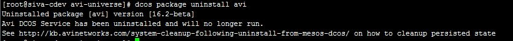

This article describes how to install Avi Vantage into an Open DC/OS or Enterprise DC/OS cloud, using DC/OS Universe.

The Avi Vantage installation package is available as part of the DC/OS Universe repository.

## Installation

Ensure the DC/OS CLI package is installed. (See a <a href="https://docs.mesosphere.com/usage/cli/">https://docs.mesosphere.com/usage/cli/</a> for instructions.)

### Using the DC/OS CLI

To view the options available during installation:
dcos package describe avi

**Example:**

To begin installation:

dcos package install avi

**Example:**

### Advanced Installation Options

To view all configuration options:
dcos package describe avi --config --render

**Example:**

### Using the DC/OS Web Interface

Select the avi-vantage installation package from the applications catalog:

For basic installation, click Install Package: 
After installation is complete, a success dialog appears: 

### Advanced Installation Options

For advanced installation, click Advanced Installation.
Enter or select option values, then click Review and Install.

After installation is complete, a success dialog appears: 

## Viewing Deployment Status

To view deployment status within Marathon, see the Dashboard. In the following example, the deployment is still in progress:

In this example, deployment is complete and Avi Vantage is running:

## Application Auto-discovery

Avi Vantage auto-discovers the applications running through Marathon, and creates a virtual service configuration for each of the applications. This example shows a set of four applications running in Marathon:

Vantage creates virtual service configurations for each of the applications:

Likewise, when a new application is added to Marathon, Vantage auto-discovers the new application and creates a virtual service configuration for it. In this example, a new application called "webapp1" is added in Marathon:

Vantage discovers the new applications and creates a virtual service configuration for it:

## Uninstalling

If Vantage needs to be uninstalled, use the following CLI command.

Note: Package un-installation is currently available only via the DC/OS CLI.
dcos package uninstall avi

**Example:**

Note: Also <a href="/system-cleanup-following-uninstall-from-mesos-dcos/">click here</a> for post-uninstall cleanup instructions.