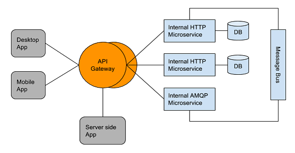

## What is an API Gateway

In microservice-based architectures, an API gateway allows developers to easily consume services required for their client or server applications, by exposing a single end-point to those applications. The API gateway acts as a bridge between applications and microservices.

## Load Balancing the API Gateway

The availability of the API gateway is key to ensuring the application availability. API gateway availability requires a load balancer that can provide flexibility to cope with rapid changes in microservices, such as versioning and dynamically shifting scale. In addition, being exposed to the external network, the API gateway should be able to provide secure transportation and authentication, and different access policies for external clients and internal clients. On top of this, the API gateway requires protection from DDoS attacks.

Often, API response time directly impacts the end-user experience; therefore, it is critical to also have a monitoring tool that also can provide complete API transaction logs.

## Avi Vantage Solution

Avi Vantage provides the following out-of-box benefits when deployed to load balance API gateways:

* **API versioning through easy-to-use Layer 7 policy**

* Route API calls to different pools based on version information
* Redirect API calls to the default API version pool
* **API quality monitoring with full visibility**

* Score API quality based on response time, response code error ratio, and resource utilization
* Pinpoint API bottlenecks: are they in the client-facing network? Data center network? API gateway itself?
* Full API transaction logs per client IP, device type, and so on: 
* **Secure API with access control**

* End-to-end encryption with client certificate authentication
* Redirect for non-secure APIs to secure APIs
* Block/allow API calls based on custom IP groups
* Per-client rate limiting
* DDoS attack mitigation with detailed attack information (example: Top-*N* attackers)    