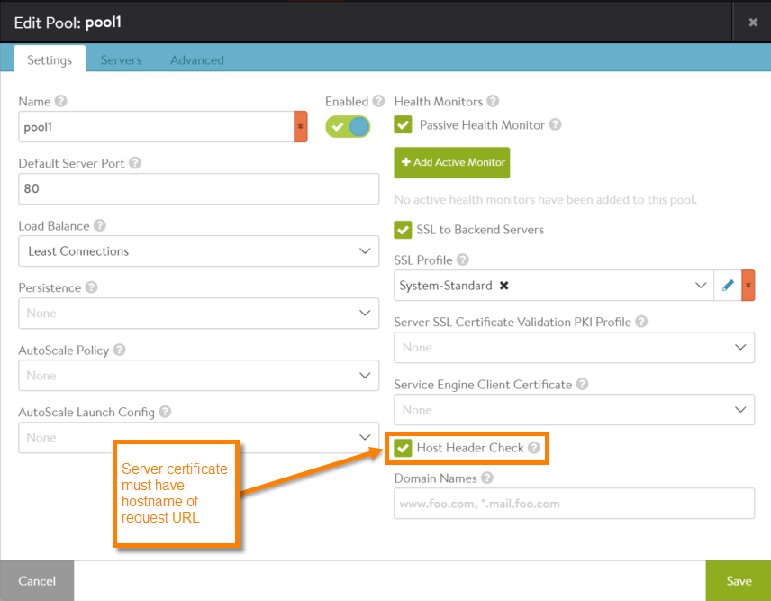

Avi Vantage SSL support includes multi-level domain name support. Multi-level domain support allows a pool to be configured with a list of multiple domain names for server certificate verification. During SSL session setup between a back-end server and Avi Service Engine (SE), Avi Vantage checks the server's certificate for the domain names listed in the pool. If any of the domain names are found in the certificate, the SSL session is allowed. However, if the certificate presented by the back-end server does not contain any of the domain names listed in the pool, the SSL session is not allowed.

Within a pool configuration, the SSL settings for securing connections to the back-end servers include an option to enable host header checking. After enabling this option, the domain name list can be specified. The type of matching used to verify the certificate's server name depends on how these options are configured.
<table class="table"> 
 <tbody> 
  <tr> 
   <th>Host Header Check</th> 
   <th>Domain Name List</th> 
   <th width="60%">How Server Name Matching Is Performed</th> 
  </tr> 
  <tr> 
   <td>N</td> 
   <td>Not configurable</td> 
   <td>Not checked</td> 
  </tr> 
  <tr> 
   <td>Y</td> 
   <td>N</td> 
   <td>Domain name in certificate's Common Name or Subject Alternative Name field must match hostname of request URL. If the domain name list is configured (not empty) but does not match any name in the certificate, the connection is denied.</td> 
  </tr> 
  <tr> 
   <td>Y</td> 
   <td>Y</td> 
   <td>Domain name in certificate's Common Name or Subject Alternative Name field must match domain name in pool's domain name list. If the hostname of the requested does not match a hostname in the certificate, the connection is denied.</td> 
  </tr> 
 </tbody> 
</table>

### Upgrade Note

The option to enable host header checking is not new in 16.2. However, in previous releases, the option is set in the PKI profile rather than in the pool. During upgrade from 16.1, if the configuration contains a PKI profile in which host header checking is enabled, that option is migrated from the PKI profile configuration into the individual pool configurations. This change does not need to be made by the Vantage user.

## Configuring Multi-level Domain Support

1. Navigate to Applications Pools.
1. Click the edit icon next to the pool name, or click Create Pool if creating a new one.
1. On the Settings tab, select the SSL to Backend Servers checkbox. Additional SSL configuration fields for the pool appear.

1. Select the Host Header Check checkbox. The Domain Names field appears.

* To check strictly based on the request URL hostname, leave the Host Header Check checkbox selected and leave the Domain Names field blank.

* To ***instead*** check based on a list of domain names, enter them in the Domain Names field.

* To save the pool, click Next until the Review tab appears, then click Save.

Note: If creating a new pool, a name is required before the pool can be saved.