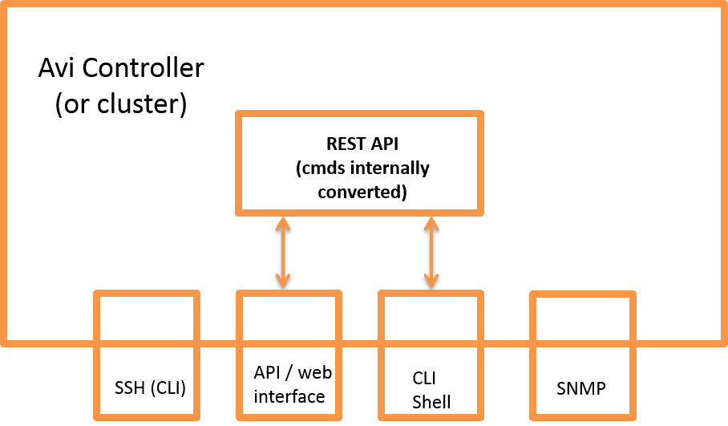

By default, the Avi Controller does not restrict the client IP addresses that are allowed to attempt access to the Avi Controller through its management interfaces. Beginning in 16.2, Avi Vantage provides a way to define the set of IP addresses that are allowed to attempt management access to the Avi Controller.

Additionally, access through all the management interfaces can be further restricted by explicitly specifying the ciphers and keyed-hash message authentication codes (HMACs) that are allowed. To establish a management connection with the Avi Controller through any management interface, the client must support a cipher and HMAC that are allowed by the Avi Controller.

This article describes how to restrict access to the Avi Controller's management interfaces, and how to restrict the list of ciphers and HMACs that are allowed for management sessions.

## IP Access Lists

When the configuration is modified to specify the IP addresses that are allowed to access specific management interfaces, Vantage programs the Linux IP tables on the Avi Controller host to allow the specified IP addresses at the network layer.

Separate IP access lists can be configured for each of the following management interfaces:

* REST API / Web interface (or any script or other means of automation that uses the REST API)
* SSH daemon
* CLI Shell (allows <a href="/cli-installing-the-cli-shell/">remote CLI access</a>)
* SNMP

Here is a logical view of the management interfaces.

Note: Vantage internally converts commands that are entered through the web interface or the CLI shell into REST API commands. Likewise, the system responses are converted back into web interface or CLI format when presented back to the Vantage user. However, to restrict IP access through the interfaces, separate IP lists must be entered for each interface.

### IP Access List Format

For each management interface, the set of client IP addresses that are allowed to access that interface can be specified in any of the following ways:

* Individual IP addresses; example: 1.1.1.1, 2.2.2.2
* IP address ranges; example: 1.1.1.1-1.1.1.100
* IP address prefixes (subnets); example: 1.1.1.0/24
* IP address groups

**Cautions**

* If changing the IP access list for the management interface you are using to make the change, make sure your IP address is included in the access list. Otherwise, your management session will end after the change is saved.
* If no IP addresses are added to a management service's access list, ***any*** IP address is allowed to attempt access to that service.

## Restricting IP Access to Management Interfaces

### Web Interface

1. Navigate to Administration > Settings > Access Settings.
1. Click the edit icon to open the Update System Access Settings popup.

1. In the Client Management Access to Avi Controller section, click the field next to the management interface to be restricted, and enter or select the IP addresses that are allowed access.

* Host, range, or subnet: Click the field or select Custom Value to activate the field, then type the address(es). If listing multiple addresses, use commas to delimit them. If entering a range, use a hyphen between the starting (lowest) and ending (highest) addresses.
* IP group: Select the IP group (if already configured) or click Create to create the group (list) now. Enter the group name and address information, then click Save to return to the Update System Access Settings popup.
* Click the plus sign ( + ).

* Repeat for any additional IPs to be allowed to access the service.
* When finished specifying the allowed client IP addresses for each management service, go to the next section or click Save to save the changes and close the popup.

## Restricting the Allowed Ciphers

By default, Vantage allows management sessions to use any of the following ciphers:

* aes128-ctr
* aes256-ctr
* arcfour256
* arcfour128
* aes128-cbc
* 3des-cbc
* blowfish-cbc
* aes192-cbc
* aes256-cbc

To restrict access to a subset of these ciphers, specify the individual ciphers:

1. In the Update System Access Settings popup, in the Allowed Ciphers field, enter the cipher names. The names must be spelled as shown above. Use commas between the names.
1. Go to the next section or click Save.

## Restricting the Allowed HMACs

By default, Vantage allows management sessions to use any of the following HMACs:

* hmac-md5
* hmac-md5-96
* hmac-sha1
* umac-128-etm@openssh.com
* hmac-sha1-96
* hmac-sha256@ssh.com
* umac-64-etm@openssh.com
* hmac-sha256-96@ssh.com
* hmac-sha2-512
* hmac-ripemd160
* hmac-ripemd160-etm@openssh.com
* hmac-md5-96-etm@openssh.com
* hmac-md5-etm@openssh.com
* hmac-sha2-512-etm@openssh.com
* hmac-sha2-256-etm@openssh.com
* hmac-sha1-96-etm@openssh.com
* hmac-sha1-etm@openssh.com

To support fewer HMACs, specify the individual HMACs:

1. In the Update System Access Settings popup, in the Allowed HMACs field, enter the HMAC names. The names must be spelled as shown above. Use commas between the names.
1. When finished, click Save to save the changes and close the popup.

### REST API

### IP Addresses That Are Allowed Management Access

The following request to the Vantage REST API retrieves the current system settings, including the mgmt_ip_access_control section. This section specifies the client IP addresses that are allowed to access the Avi Controller through the management services. In this example, access through the web interface or REST API is restricted to addresses in the 10.10.0.0/16 subnet, and to IP addresses in the range 3.3.3.1-100. IP access for the other management services is not included in this output, because IP access has not been explicitly defined for them.
<pre>API: GET /api/systemconfiguration
Data:
{
    "email_configuration": {
        "from_email": "admin@avicontroller.net",
        "mail_server_name": "localhost",
        "smtp_type": "SMTP_NONE",
        "mail_server_port": 25
    },
	...

    "mgmt_ip_access_control": {
        "api_access": {
            "ranges": [
                {
                    "begin": {
                        "type": "V4",
                        "addr": "3.3.3.0"
                    },
                    "end": {
                        "type": "V4",
                        "addr": "3.3.3.100"
                    }
                }
            ],
            "prefixes": [
                {
                    "ip_addr": {
                        "type": "V4",
                        "addr": "10.10.0.0"
                    },
                    "mask": 16
                }
            ],
            "match_criteria": "IS_IN"
        }
    },
}
</pre>

### Allowed Ciphers and HMACs

The following REST API request retrieves the list of allowed ciphers and HMACs.
<pre>API: GET /api/systemconfiguration
Data:
{
    "email_configuration": {
        "from_email": "admin@avicontroller.net",
        "mail_server_name": "localhost",
        "smtp_type": "SMTP_NONE",
        "mail_server_port": 25
    },
        ...

    "ssh_ciphers": [
        "aes128-ctr",
        "aes256-ctr",
        "aes192-cbc",
        "aes256-cbc"
    ],

    "ssh_hmacs": [
        "hmac-md5",
        "hmac-md5-96",
        "hmac-sha1",
        "hmac-sha256-96@ssh.com",
        "hmac-sha2-512"
    ],
}
</pre>